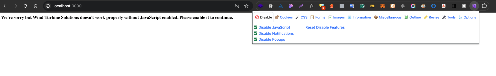

# Wind Turbine Planner

## Overview

The **Wind Turbine Planner** is a React-based application designed to help plan maintenance activities for wind turbines by leveraging real-time wind data. The application fetches and displays wind speed, direction, and other weather-related metrics for the next two days. Users can input the coordinates of their turbines and visualize the data through intuitive charts, tables, and interactive maps.

---

### Features

1. **Live Wind Data:**

   - Fetches real-time weather data, including wind speed, direction, humidity, pressure, and visibility.
   - Displays forecasts for hourly and daily wind conditions using the OpenWeatherMap API.

2. **User-Friendly Data Display:**

   - **Charts:** Visualizes hourly wind speed and gust trends with interactive and responsive line charts.
   - **Tables:** Provides detailed daily metrics, such as wind speed, direction, humidity, temperature, and pressure etc.
   - **Weather Summary:** Displays a compact summary of current weather conditions for the selected coordinates.

3. **Turbine Coordinates Input:**

   - Intuitive form for entering turbine coordinates (latitude and longitude).
   - Real-time validation ensures users enter valid latitude (`-90 to 90`) and longitude (`-180 to 180`).

4. **Interactive Map:**

   - Displays the turbine's location on a dynamic map using Leaflet.
   - Includes reverse geocoding to fetch the nearest location name based on coordinates.
   - Features zoom controls and full-screen map view for a better user experience.

5. **Error Handling:**

   - Gracefully handles API errors with user-friendly error messages.
   - Provides instant feedback for invalid coordinate inputs.

6. **Responsive UI:**

   - Optimized for both desktop and mobile devices.
   - Ensures smooth interaction and visual clarity across varying screen sizes.

7. **Build and Deployment:**

   - Ready to deploy application with a simple build process using Vite.
   - Modular codebase with TypeScript and linting ensures high-quality and maintainable code.

8. **Accessibility:**
   - Uses semantic HTML and ARIA roles for enhanced accessibility.
   - Tables and charts are designed to be screen-reader-friendly.

---

### Tech Stack

- 🖥️ **Frontend:** React (with TypeScript and SWC for fast builds)
- 🎨 **Styling:** SCSS module for styling (future we can add tailwind or something else if needed)
- 📊 **Data Visualization:** Chart.js (via `react-chartjs-2`) for interactive charts
- 🗺️ **Maps:** Leaflet and React-Leaflet for interactive maps
- ✅ **Validation:** Zod for real-time input validation
- 🌐 **HTTP Client:** Axios for API communication
- 🌥️ **API:** OpenWeatherMap API (One Call 3.0) for live weather data
- ⚡ **Build Tool:** Vite for a fast and efficient build process

---

### Getting Started

#### Prerequisites

- Node.js (v16+ recommended)
- An API key from [OpenWeatherMap](https://openweathermap.org/api) (sign up for a free tier).

#### Installation

1. Clone the repository:

   ```bash
   git clone https://github.com/Milan-960/Wind-turbine-solutions.git
   cd wind-turbine-planner
   ```

2. Install dependencies:

   ```bash
   npm install
   ```

3. Add your OpenWeatherMap API key:

   - Create a .env file in the project root.
   - Add the following line:

   ```bash
   OPENWEATHER_API_KEY=your_api_key_here
   ```

4. Start the development server:

   ```bash
   npm run dev
   #OR
   npm start
   ```

5. Open the app in your browser at http://localhost:3000.

#### Scripts

- npm run dev: Start the development server.
- npm run build: Build the application for production.
- npm run preview: Preview the production build locally.
- npm run lint: Run ESLint to check for code quality issues.

### Disable JS

In case of if the javascript is disable on the users browser we show this message check this out on the below IMG:


